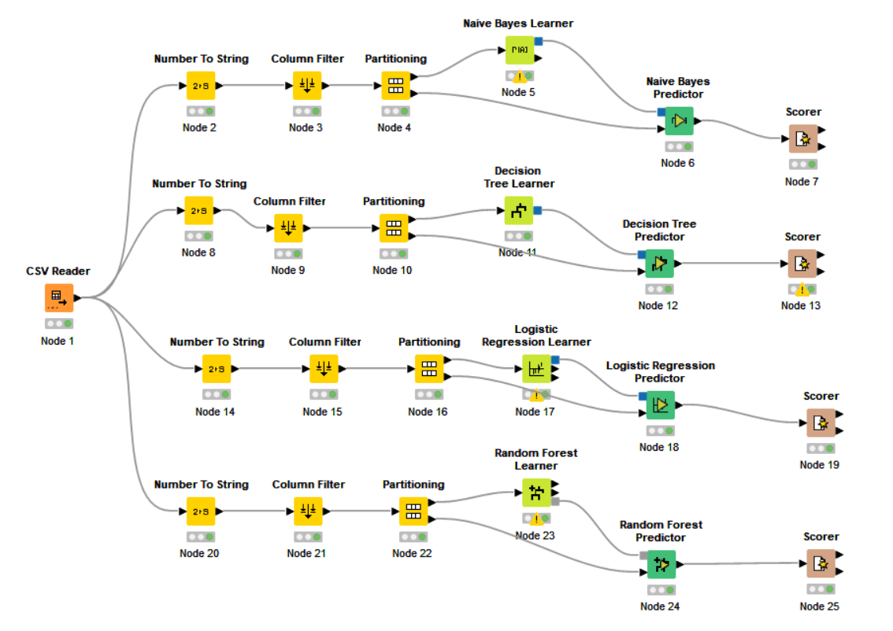
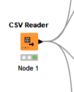
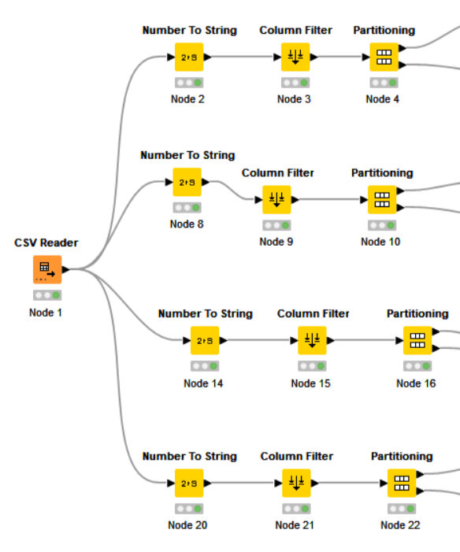
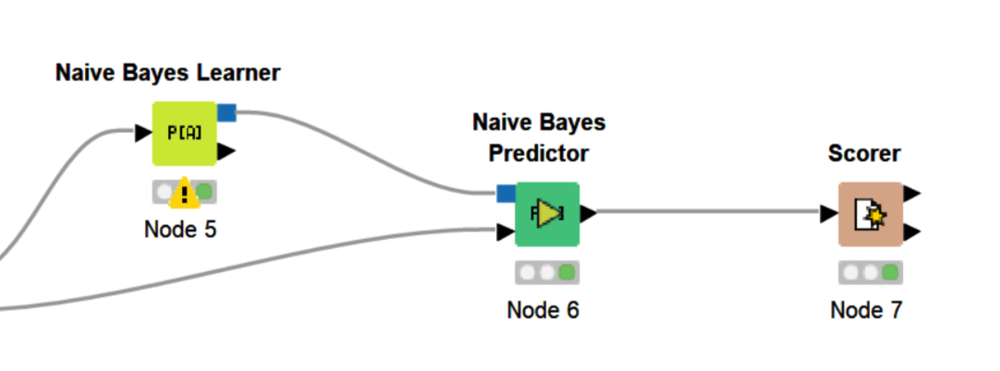
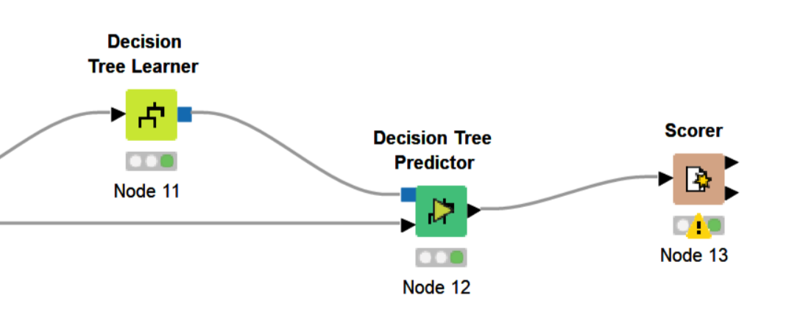
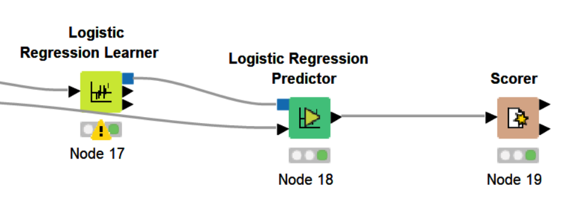
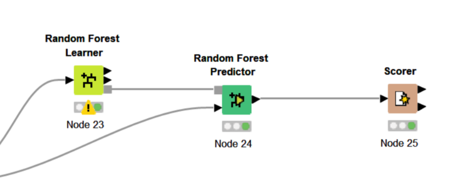
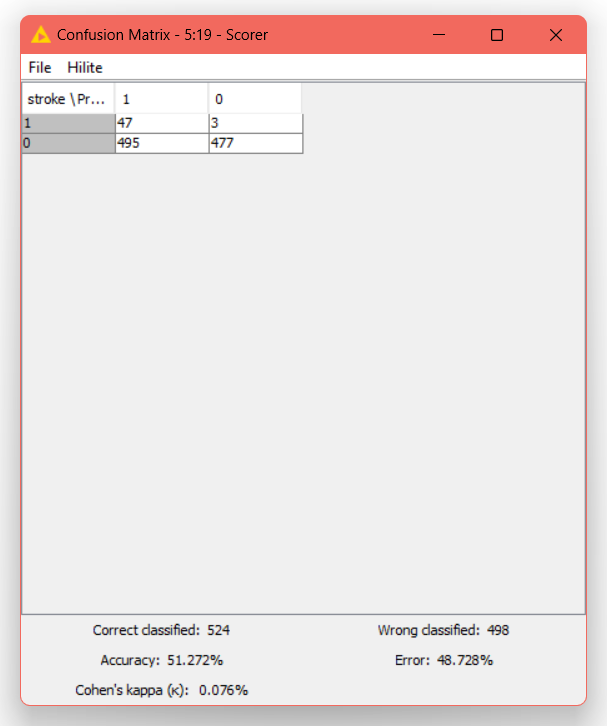
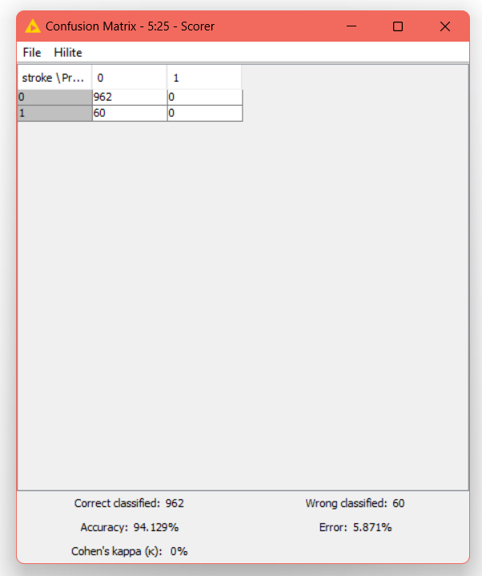

# codeless-ai-ml-2022

# Overview
The project is a classification type project using a Stroke Prediction Dataset on Kaggle.

https://www.kaggle.com/datasets/fedesoriano/stroke-prediction-dataset

This dataset is used to predict whether a patient is likely to get stroke based on the input parameters like gender, age, various diseases, and smoking status. Each row in the data provides relavant information about the patient.

In this project, we will determine which machine learning algorithm will be useful with this dataset.

  

# Tool
knime

# Nodes being used in KNIME
-CSV Reader

-Number to String

-Column Filter 

-Partitioning

-Naive Bayes Learner

-Naive Bayes Predictor

-Decision Tree Learner

-Decision Tree Predictor

-Logistic Regression Learner

-Logistic Regression Predictor

-Random Forest Learner

-Random Forest Predictor

-Scorer 

# Model
*1.Our dataset is in CSV format, so we need a CSV reader node to access it*

  

using CSV Reader node for access data. 
*2.Data Cleaning*

  

Converts numbers in a column (or a set of columns) to strings. I use Column filter to remove columns that not important for use and use Partitioning to divide information, The first is for the ML to learn and the other is for the ML to test. 
*3.classification model (Naive Bayes model)*

  

using Naive Bayes Learner node and Naive Bayes Predictor node. 
*4.classification model (Decision Tree model)*

  

using Decision Tree Learner node and Decision Tree Predictor node. 
*5.classification model (Logistic Regression model)*

  

using Logistic Regression Learner node and Logistic Regression Predictor node. 
*6.classification model (Random Forest model)*

  

using Random Forest Learner node and Random Forest Predictor node. 
*7.score of each classification model* 
-Naive Bayes model

  

-Decision Tree model

  

-Logistic Regression model

  

-Random Forest model

  

# Conclusion
In summary, using the Random Forest model gives the best accuracy with a score of 94.129% Error: 5.871%, Random Forest model fit this data best.

  

# Member name
-Nurhaya Benraheem 632431008 
-Waenurhuda Hayeewaeming 632431004